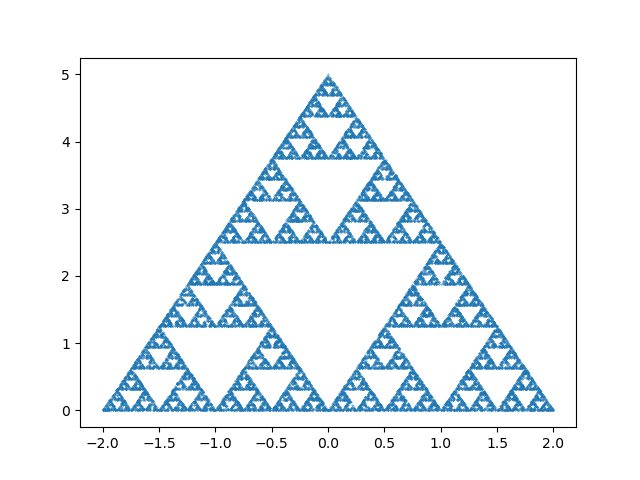

I saw a video about a simple algorithm to draw a Sierpiński triangle, so I thought I would try it out.

*Step 1: add the triangle vertices.
*Step 2: add a random point within the verticies.
*Step 3: keep adding new points located halfway between the most recently added point and a random vertex.

